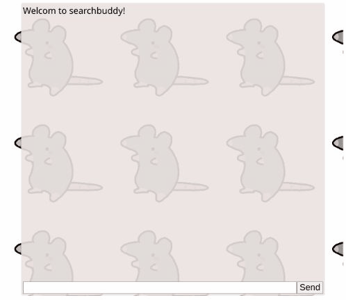

# searchbuddy 

Make friends while searching!

Searchbuddy is a browser extension that lets you chat with people that are
searching for what you're searching for.

## Goals

### Learn
The primary reason for creating searchbuddy was to gain experience in new technologies.
This is my first experience writing a scalable system. This is my first experience
using cassandra. This is my first experience deploying service using containers.

### Design a scalable system
Searchbuddy has been architecture for scalability. Every service is designed to 
run concurrent with as many instances as needed. Cassandra was chosen because it
has linear scalability. The main service is designed to lookup chatroom instances in
constant time. As a result, searchbuddy can scale up to handle Google levels of
searches.

  

## Future Plans

### Implement accounts
Currently, searchbuddy is completely anonymous. In the future, I would like to implement
user accounts and authentication.

### Better system handling chatrooms instances joining and leaving the cluster.
Currently, the list of chatroom instances is fixed. In the future, I would like to
implement a service for registering and location instances. This will make scaling
simpler.

## License
Licensed under the MIT license.
